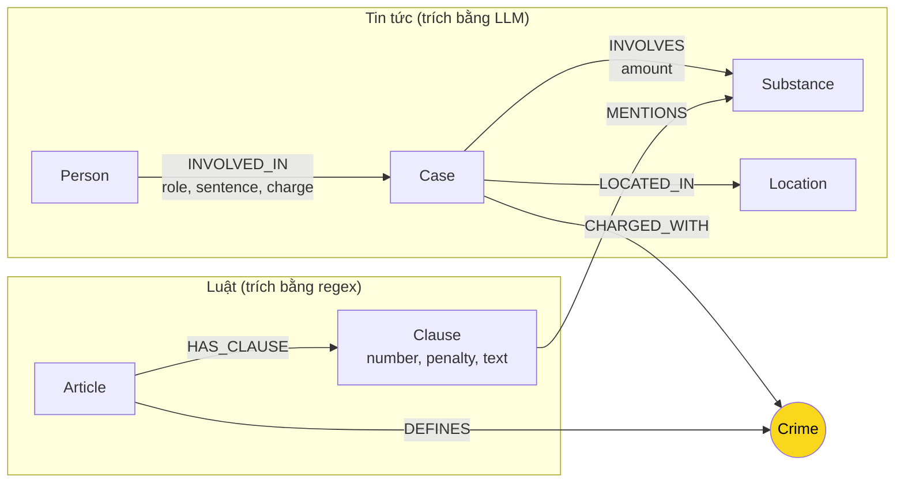

# Thiết kế Ontology — Day 19

**Họ tên:** Đặng Quang Huy  **MSSV:** 02962

**Lựa chọn** (đánh dấu một):
- [x] Dùng ontology gợi ý (có thể chỉnh nhỏ)
- [ ] Tự thiết kế (xét bonus +15, xem `SUBMISSION.md`)

> Ontology này khớp với graph thật trong Neo4j (label và quan hệ do `src/graph.py` dựng: `suggested_constraints`, `add_law_article`, `add_news_case`).

## 1. Sơ đồ

Node cầu nối là `Crime` (tô vàng): luật định nghĩa tội qua `DEFINES`, vụ án trong tin bị truy tố tội đó qua `CHARGED_WITH`.

## 2. Entity types (node labels)

| Label | Ý nghĩa | Khóa định danh (`MERGE` theo) | Properties | Lấy từ KB nào | Trích bằng (regex / LLM / khác) |
| --- | --- | --- | --- | --- | --- |
| `Article` | Một Điều luật (BLHS hoặc PCMT) | `id` (vd. `"Điều 251 BLHS"`) | `id`, `title`, `law`, `doc_id` | luật | regex (`parse_law_article`, metadata crawler) |
| `Clause` | Một khoản trong Điều | `id` (vd. `"Điều 251 BLHS khoản 1"`) | `id`, `number`, `penalty`, `text`, `doc_id` | luật | regex tách `1.`, `2.`… |
| `Crime` | Tội danh đã chuẩn hóa | `name` (vd. `"mua bán trái phép chất ma túy"`) | `name` | luật (tiêu đề Điều); tin map vào | regex tiêu đề `Tội …` + `normalize_crime` / `link_entity` |
| `Case` | Một vụ việc trong bài báo | `name` (LLM đặt) | `name`, `summary`, `date`, `doc_id`, `source_title` | tin | LLM JSON |
| `Person` | Người liên quan vụ | `name` | `name`, `aliases` | tin | LLM JSON |
| `Substance` | Chất ma túy / tiền chất | `name` | `name` | cả hai | regex danh sách chuẩn (luật); LLM (tin) |
| `Location` | Tỉnh/thành nơi xảy ra vụ | `name` | `name` | tin | LLM JSON |

`Article` và `Clause` luôn có `doc_id` = `Document.id` của file luật. `Case` có `doc_id` của bài báo. `Crime`, `Substance`, `Location`, `Person` là node dùng chung nên không gắn `doc_id` (đúng hợp đồng: chỉ node sinh ra từ **một** tài liệu mới bắt buộc có `doc_id`).

## 3. Relationships

| Type | Từ → Đến | Properties trên cạnh | Ý nghĩa |
| --- | --- | --- | --- |
| `DEFINES` | Article → Crime | (không) | Điều luật định nghĩa tội danh |
| `HAS_CLAUSE` | Article → Clause | (không) | Điều chứa khoản |
| `MENTIONS` | Clause → Substance | (không) | Khoản nêu tên chất / ngưỡng khối lượng |
| `CHARGED_WITH` | Case → Crime | (không) | Vụ bị truy tố / xét xử về tội này |
| `INVOLVES` | Case → Substance | `amount` | Vụ liên quan chất, kèm khối lượng nếu có |
| `LOCATED_IN` | Case → Location | (không) | Vụ xảy ra / xét xử tại địa điểm |
| `INVOLVED_IN` | Person → Case | `role`, `sentence`, `charge` | Người tham gia vụ; vai trò, mức án, tội của người đó |

Mức án để trên cạnh `INVOLVED_IN` vì cùng một vụ nhiều người có án khác nhau. Khối lượng để trên `INVOLVES` vì một vụ có thể có nhiều chất.

## 4. Node cầu nối giữa 2 KB

- **Node nào:** `Crime` (tội danh đã chuẩn hóa).
- **Vì sao chọn node này:** Tên bị cáo, mức án, địa điểm chỉ có trong tin; số Điều, khoản, khung hình phạt chỉ có trong luật. Thứ xuất hiện ở **cả hai** KB là tội danh: tiêu đề Điều BLHS (`Tội mua bán…`) và tội mà báo viết bị cáo bị tuyên. Đi `Case -CHARGED_WITH-> Crime <-DEFINES- Article` là đủ để trả lời câu cross-kb dạng “bị cáo X, tội gì, Điều nào, khung bao nhiêu”.
- **Cách đảm bảo hai phía khớp tên:**
  1. Luật: `normalize_crime` bỏ tiền tố `"Tội "`, lower-case, gom khoảng trắng.
  2. Prompt tin nhận **danh sách tội chuẩn** lấy từ các `Article` đã parse.
  3. Sau LLM, `link_entity` chuẩn hóa hai phía, khớp exact rồi `difflib.get_close_matches(cutoff=0.8)` để gộp biến thể (`tuý`/`túy`, hoa/thường). Không đủ giống thì `None` — không nối bừa.
- **Khi nào cầu gãy, và bạn xử lý thế nào:**
  - LLM không trích được `charges`, hoặc trích tội không nằm trong danh sách → `CHARGED_WITH` thiếu → vụ mồ côi. `context()` vẫn trả seed 1-hop từ `doc_id`; không bịa Điều luật.
  - Hai bài gọi cùng tội lệch dấu → `link_entity` gom về tên trong `known`.
  - Bài tuyên truyền / hội nghị không có vụ cụ thể → prompt bắt `{"cases": []}`, không tạo `Case` rác.

## 5. Competency questions

| Câu | Đường đi (Cypher pattern) | Trả lời được? |
| --- | --- | --- |
| Q1 | `(:Article {id:'Điều 2 PCMT'})-[:HAS_CLAUSE]->(:Clause)` — định nghĩa “tiền chất” nằm trong một khoản luật | Có, nhưng graph không cần thiết: đáp án gói trong một đoạn PCMT. Vector top-k của Flat RAG đủ. |
| Q2 | `(:Person)-[:INVOLVED_IN {sentence}]->(:Case)` lọc `sentence` chứa “tử hình”, kết hợp chunk tin TAND TP.HCM 28-9 | Có phần “ai lãnh tử hình” từ cạnh `INVOLVED_IN`. Không cần nhảy sang luật. |
| Q3 | `(:Person {name:'Lê Minh Thành'})-[:INVOLVED_IN {sentence}]->(:Case)-[:CHARGED_WITH]->(:Crime)<-[:DEFINES]-(:Article)-[:HAS_CLAUSE]->(:Clause {number:1})` | Có: mức án trên cạnh, tội trên `Crime`, Điều + khung khoản 1 trên `Article`/`Clause`. Đây là câu ontology được thiết kế để trả lời. |
| Q4 | `(:Person)-[:INVOLVED_IN]->(:Case)-[:CHARGED_WITH]->(:Crime)<-[:DEFINES]-(:Article {id:'Điều 255 BLHS'})-[:HAS_CLAUSE]->(:Clause)` | Có tội + Điều. **Yếu** ở “phạt tù tối đa”: ontology không có property `max_penalty`; `context()` ưu tiên khoản 1 + khoản `MENTIONS` chất vụ liên quan, có thể bỏ khung cao nhất (chung thân). |
| Q5 | `(:Person)-[:INVOLVED_IN]->(:Case)-[:INVOLVES {amount}]->(:Substance {name:'MDMA'})` và `(Case)-[:CHARGED_WITH]->(:Crime)<-[:DEFINES]-(:Article)-[:HAS_CLAUSE]->(:Clause)-[:MENTIONS]->(:Substance)` | Có tội, chất, Điều. **Không** tự chọn “khoản 4 vì ≥ 100g”: không mô hình hóa ngưỡng khối lượng trong khoản luật, chỉ giữ khoản 1 + khoản `MENTIONS` cùng chất. |
| Q6 | `(:Case)-[:INVOLVES]->(:Substance {name:'MDMA'})<-[:INVOLVES]-(:Case)<-[:INVOLVED_IN]-(:Person)` | Có danh sách vụ/người gắn MDMA. Phụ thuộc LLM có gắn đúng `Substance` tên chuẩn `"MDMA"`; tên đồng nghĩa (“kẹo”, “cỏ Mỹ”) có thể tách node. |

## 6. Quyết định thiết kế và đánh đổi

1. **Cầu nối là `Crime`, không phải `Substance`.** Phương án khác: nối 2 KB qua chất (luật `MENTIONS` Heroine, tin `INVOLVES` Heroine). Chọn tội danh vì câu benchmark hỏi “tội gì / Điều nào / khung phạt”, không hỏi “chất này bị phạt thế nào theo khoản nào” là câu chính. Đánh đổi: vụ không trích được tội thì cầu gãy dù vẫn có chất.
2. **Luật regex, tin LLM.** Phương án khác: LLM cả hai KB cho đồng nhất schema. Văn bản luật đều (`Điều N.`, khoản `1.`, điểm `a)`) nên regex rẻ, deterministic, không tốn token indexing. Tin là văn xuôi nên regex không bắt được tên người/mức án. Đánh đổi: regex bỏ sót chú thích / khoản viết lệch; LLM tin không ổn định giữa các lần chạy.
3. **Lọc khoản trong `context()`: khoản 1 + khoản cùng chất với vụ.** Phương án khác: nhét mọi khoản của Điều vào prompt. Chọn lọc để prompt GraphRAG không phình (mỗi Điều BLHS có nhiều khoản, mỗi khoản dài). Đánh đổi: câu hỏi mức phạt **tối đa** hoặc khoản theo **ngưỡng kg** (Q4, Q5) có thể thiếu đúng khoản — đây là lỗi E2 đã biết.
4. **Mức án là property cạnh `INVOLVED_IN`, không phải node.** Phương án khác: `(:Sentence {text})`. Property gọn, `MERGE` ít node hơn. Đánh đổi: khó gom “tất cả án tử hình” nếu LLM viết `tử hình` / `tử` / `án tử` khác nhau.
5. **Khóa `Case`/`Person` theo `name` do LLM đặt.** Phương án khác: khóa theo `doc_id + tên chuẩn`. Chọn `name` để `MERGE` người xuất hiện nhiều bài thành một node. Đánh đổi: trùng thực thể (E3) khi LLM đặt hai tên cho cùng người, hoặc gộp nhầm hai người trùng họ tên.

## 7. So với ontology gợi ý (bắt buộc nếu xét bonus)

Không xét bonus. Graph dùng nguyên ontology gợi ý trong các hàm HINT của `src/graph.py`.

## 8. Hạn chế còn lại

- `Substance` không gộp đồng nghĩa (`Heroine`/`heroin`/`cần sa`/`cỏ Mỹ`/`kẹo` MDMA).
- Không có node/property ngưỡng khối lượng (`100 gam trở lên` → khoản 4), nên Q5 dễ trả khoản 1.
- Không tách giai đoạn tố tụng (bắt / khởi tố / sơ thẩm / phúc thẩm) — một `Case` gộp cả kháng cáo.
- `Person`/`Case` khóa theo tên LLM nên E3 (trùng node) là lỗi thiết kế, không chỉ lỗi trích xuất.
- `context()` không đi `Clause` theo “khung cao nhất”, nên Q4 có thể thiếu “chung thân”.
